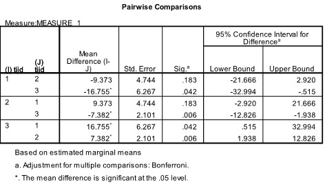

```{r, echo = FALSE, results = "hide"}
include_supplement("uu-Oneway-repeated-measures-ANOVA-601-nl-tabel.jpg", recursive = TRUE)
```


Question
========
  
Er is een onderzoek gedaan waarbij de openheid van een persoon binnen een relatie is gemeten op drie tijdstippen. Om de verschillen tussen de tijdstippen nader te onderzoeken zijn er Post-Hoc toetsen uitgevoerd. 


  
Welke conclusie kan er getrokken worden op basis van deze output?

Answerlist
----------
* Er is geen significante toename in openheid tussen tijdstip 1 en 2, maar wel een significante toename tussen tijdstip 1 en 3, en tijdstip 2 en 3. 
* Er is geen significante afname in openheid tussen tijdstip 1 en 2, maar wel tussen tijdstip 1 en 3, en tijdstip 2 en 3. 
* Er is wel een significante toename in openheid tussen tijdstip 1 en 2, maar geen significante toename tussen tijdstip 1 en 3, en tijdstip 2 en 3.
* Er is wel een significante afname in openheid tussen tijdstip 1 en 2, maar geen significante afname tussen tijdstip 1 en 3, en tijdstip 2 en 3.  


Solution
========
  


Meta-information
================
exname: uu-Oneway-repeated-measures-ANOVA-601-nl.Rmd
extype: schoice
exsolution: 1000
exsection: Inferential Statistics/Parametric Techniques/ANOVA/Oneway repeated measures ANOVA
exextra[ID]: a0079
exextra[Type]: Interpretating output
exextra[Program]: SPSS
exextra[Language]: Dutch
exextra[Level]: Statistical Literacy
