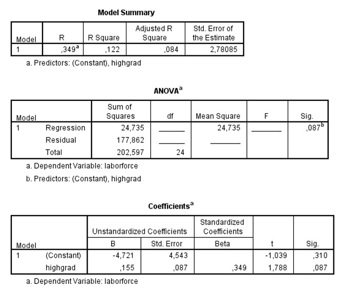

```{r, echo = FALSE, results = "hide"}
include_supplement("uu-Oneway-ANOVA-800-nl-tabel.jpg", recursive = TRUE)
```

Question
========
  
A model was built to predict unemployment by region (variable laborforce) using figures on the number of residents with a high school diploma (the variable highgrad). Part of the SPSS output is below. 



In a region that has 1 standard deviation more residents with a high school diploma than the mean (z = +1.00 for this region), we estimate that unemployment will fall standard deviations above the mean. What value should be on the line? 
Answerlist
----------
* 0.155
* 0.122
* 0.349
* -4.566


Solution
========

Meta-information
================
exname: uu-Oneway ANOVA-800-en
extype: schoice
exsolution: 0010
exsection: Inferential Statistics/Parametric Techniques/ANOVA/Oneway ANOVA
exextra[Type]: Interpretating output
exextra[Program]: SPSS
exextra[Language]: English
exextra[Level]: Statistical Literacy
