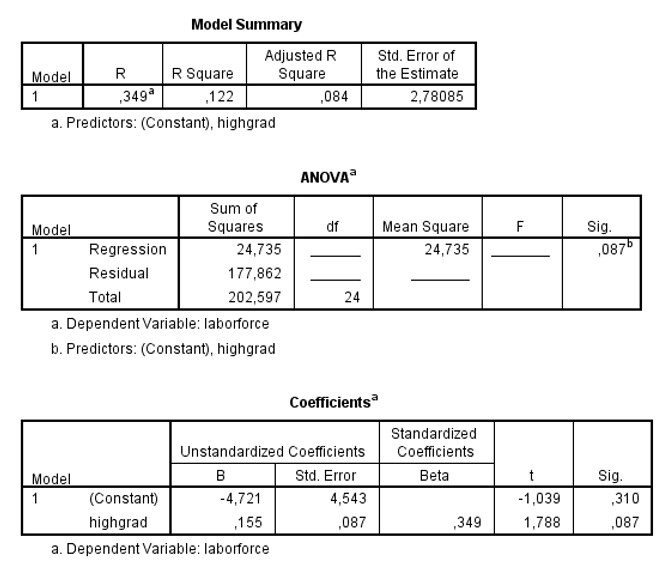

```{r, echo = FALSE, results = "hide"}
include_supplement("uu-Oneway-ANOVA-800-nl-tabel.jpg", recursive = TRUE)
```


Question
========
  
Er is een model gebouwd om werkeloosheid per regio (variabele laborforce) te voorspellen aan de hand van cijfers over het aantal inwoners met een high school diploma (de variabele highgrad). Deel van de SPSS output staat hieronder. 



In een regio die 1 standaardafwijking meer inwoners met een high school diploma heeft dan het gemiddelde (z = +1.00 voor deze regio), schatten we dat de werkeloosheid    standaardafwijkingen boven het gemiddelde zal vallen. Welke waarde hoort er op de streep te staan?
  
Answerlist
----------
* 0.155
* 0.122
* 0.349
* −4.566


Solution
========
  


Answerlist
----------


Meta-information
================
exname: uu-Oneway ANOVA-800-nl.Rmd
extype: schoice
exsolution: 0010
exsection: Inferential Statistics/Parametric Techniques/ANOVA/Oneway ANOVA
exextra[Type]: Interpretating output
exextra[Program]: SPSS
exextra[Language]: Dutch
exextra[Level]: Statistical Literacy
