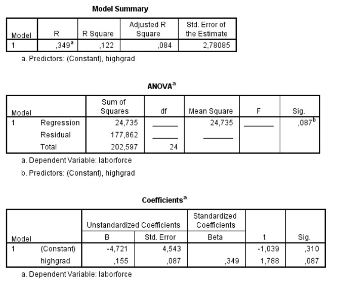

```{r, echo = FALSE, results = "hide"}
include_supplement("uu-Oneway-ANOVA-801-nl-tabel.jpg", recursive = TRUE)
```

Question
========
  
A model was built to predict unemployment by region (variable laborforce) using figures on the number of residents with a high school diploma (the variable highgrad). Part of the SPSS output is below. 



To test the significance of the model, we can perform two tests. A t-test for the directional coefficient and an F-test for R2. What is the value of the F-ratio for this second test?

  
Answerlist
----------
* 3.20
* 1.08
* 2.78
* .087

Solution
========

Meta-information
================
exname: uu-Oneway ANOVA-801-en
extype: schoice
exsolution: 1000
exsection: Inferential Statistics/Parametric Techniques/ANOVA/Oneway ANOVA
exextra[Type]: Interpretating output
exextra[Program]: SPSS
exextra[Language]: English
exextra[Level]: Statistical Literacy
