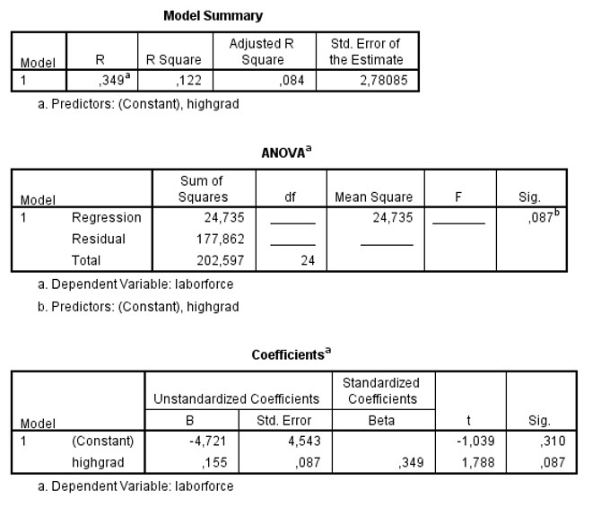

```{r, echo = FALSE, results = "hide"}
include_supplement("uu-Oneway-ANOVA-801-nl-tabel.jpg", recursive = TRUE)
```


Question
========
  
Er is een model gebouwd om werkeloosheid per regio (variabele laborforce) te voorspellen aan de hand van cijfers over het aantal inwoners met een high school diploma (de variabele highgrad). Deel van de SPSS output staat hieronder. 



Om de significantie van het model te toetsen, kunnen we twee toetsen uitvoeren. Een t-toets voor de richtingscoëfficiënt en een F-toets voor R2. Wat is de waarde van de 
F-ratio voor deze tweede toets?

  
Answerlist
----------
* 3.20 
* 1.08
* 2.78
* .087


Solution
========
  


Meta-information
================
exname: uu-Oneway ANOVA-801-nl.Rmd
extype: schoice
exsolution: 1000
exsection: Inferential Statistics/Parametric Techniques/ANOVA/Oneway ANOVA
exextra[ID]: 531f9
exextra[Type]: Interpretating output
exextra[Program]: SPSS
exextra[Language]: Dutch
exextra[Level]: Statistical Literacy
