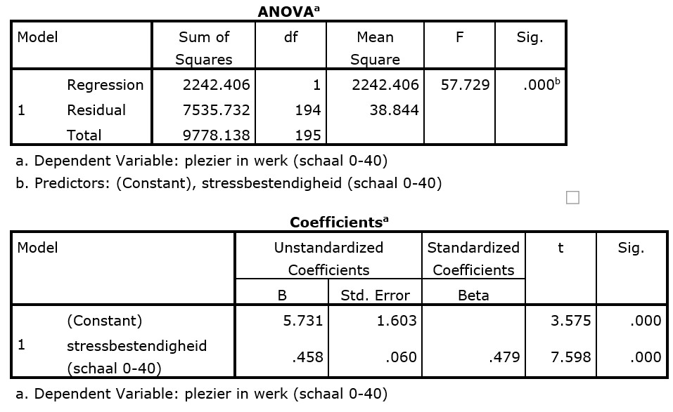

```{r, echo = FALSE, results = "hide"}
include_supplement("uu-Oneway-ANOVA-804-nl-tabel.jpg", recursive = TRUE)
```

Question
========
  
Job satisfaction is related to many factors. Researchers believe that job satisfaction can be predicted by employees' stress resistance. Below is the output of the analysis conducted for this purpose.  



Employee De Vries has a stress-resistance score of 30. His enjoyment-in-work score is 22. What is this employee's residual? 
Answerlist
----------
* 2.5
* 8
* 14.2
* 19.5

Solution
========

Meta-information
================
exname: uu-Oneway ANOVA-804-en
extype: schoice
exsolution: 1000
exsection: Inferential Statistics/Parametric Techniques/ANOVA/Oneway ANOVA
exextra[ID]: 18905
exextra[Type]: Interpretating output
exextra[Program]: SPSS
exextra[Language]: English
exextra[Level]: Statistical Literacy
