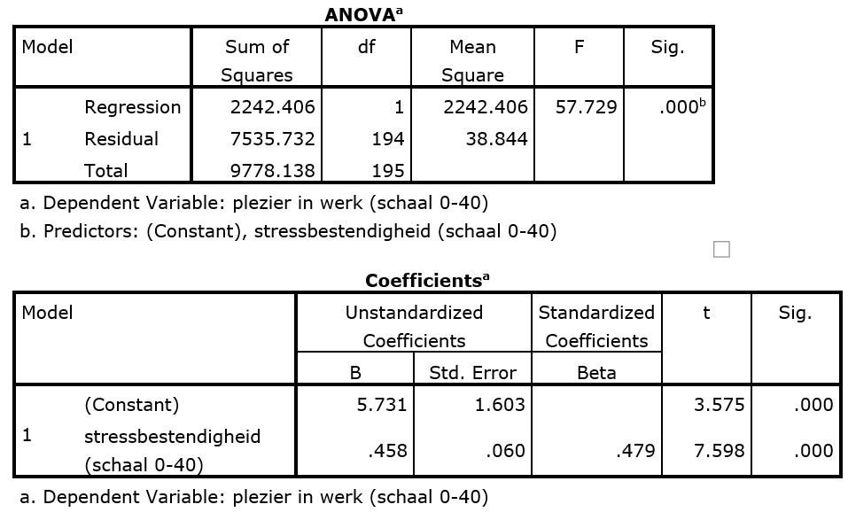

```{r, echo = FALSE, results = "hide"}
include_supplement("uu-Oneway-ANOVA-804-nl-tabel.jpg", recursive = TRUE)
```


Question
========
  
Plezier in het werk hangt met veel factoren samen. Onderzoekers denken dat plezier in het werk te voorspellen is met de stressbestendigheid van de werknemers. Hieronder vind je de output van de analyse die hiervoor is uitgevoerd.  



Werknemer De Vries heeft een stressbestendigheidsscore van 30. Zijn plezier-in-het-werk score is 22. Wat is het residu van deze werknemer?
  
Answerlist
----------
* 2.5 
* 8
* 14.2
* 19.5


Solution
========
  


Meta-information
================
exname: uu-Oneway ANOVA-804-nl.Rmd
extype: schoice
exsolution: 1000
exsection: Inferential Statistics/Parametric Techniques/ANOVA/Oneway ANOVA
exextra[Type]: Interpretating output
exextra[Program]: SPSS
exextra[Language]: Dutch
exextra[Level]: Statistical Literacy
