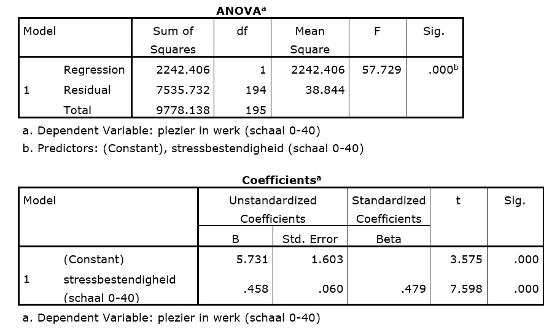

```{r, echo = FALSE, results = "hide"}
include_supplement("uu-Oneway-ANOVA-805-nl-tabel.jpg", recursive = TRUE)
```


Question
========
Plezier in het werk hangt met veel factoren samen. Onderzoekers denken dat plezier in het werk te voorspellen is met de stressbestendigheid van de werknemers. Hieronder vind je de output van de analyse die hiervoor is uitgevoerd.  



Wat is de waarde van de standaardschattingsfout?
  
Answerlist
----------
* 6.2 
* 38.8
* 47.4
* 86.8


Solution
========
  


Meta-information
================
exname: uu-Oneway ANOVA-805-nl.Rmd
extype: schoice
exsolution: 1000
exsection: Inferential Statistics/Parametric Techniques/ANOVA/Oneway ANOVA
exextra[ID]: a9ba6
exextra[Type]: Interpretating output
exextra[Program]: SPSS
exextra[Language]: Dutch
exextra[Level]: Statistical Literacy
