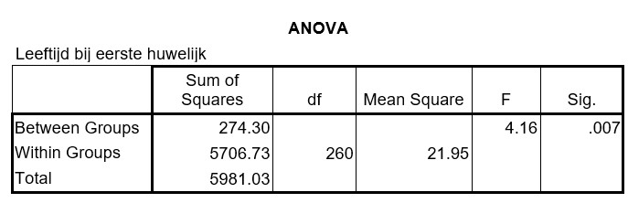

```{r, echo = FALSE, results = "hide"}
include_supplement("uu-Oneway-ANOVA-807-nl-tabel.jpg", recursive = TRUE)
```

Question
========
A study on marriage age asks married men how old they were when they got married (for the first time). The scientist wants to examine whether there are differences in average age at first marriage between men with different religious preferences: Catholic, Protestant, Islam, or none. The SPSS output of the analysis is below.  



What percentage of the total spread in ages at first marriage of these men is explained by the differences between religious preference groups? 
Answerlist
----------
* 4.16%
* 4.59%
* 21.95%
* 95.41%

Solution
========

Meta-information
================
exname: uu-Oneway ANOVA-807-en
extype: schoice
exsolution: 0100
exsection: Inferential Statistics/Parametric Techniques/ANOVA/Oneway ANOVA
exextra[ID]: 8eade
exextra[Type]: Interpretating output
exextra[Program]: SPSS
exextra[Language]: English
exextra[Level]: Statistical Literacy
