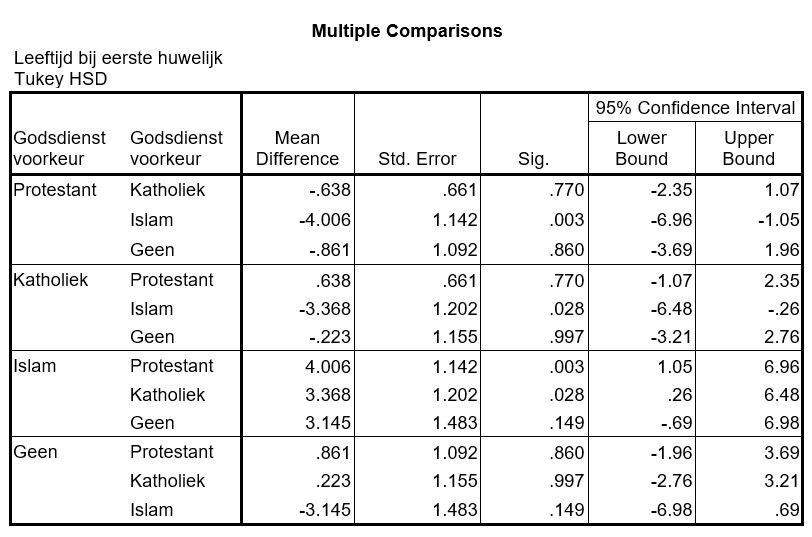

```{r, echo = FALSE, results = "hide"}
include_supplement("uu-Oneway-ANOVA-808-nl-tabel.jpg", recursive = TRUE)
```

```{r, echo = FALSE, results = "hide"}
include_supplement("uu-Oneway-ANOVA-808-nl-tabel2.jpg", recursive = TRUE)
```

Question
========
A study on marriage age asks married men how old they were when they got married (for the first time). The scientist wants to examine whether there are differences in average age at first marriage between men with different religious preferences: Catholic, Protestant, Islam, or none. The SPSS output of the analysis is below.  


With a p-value of 0.007, we can conclude that there are significant differences between the different religious preference groups. SPSS is used to do a post hoc test. The output is shown below.



Which religious preference group makes the greatest contribution to rejecting the H0? 
Answerlist
----------
* Islam
* Catholic
* Protestant
* None

Solution
========

Meta-information
================
exname: uu-Oneway ANOVA-808-en
extype: schoice
exsolution: 1000
exsection: Inferential Statistics/Parametric Techniques/ANOVA/Oneway ANOVA
exextra[Type]: Interpretating output
exextra[Program]: SPSS
exextra[Language]: English
exextra[Level]: Statistical Literacy
