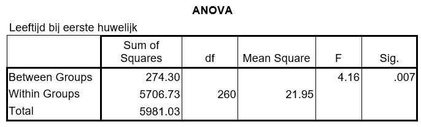
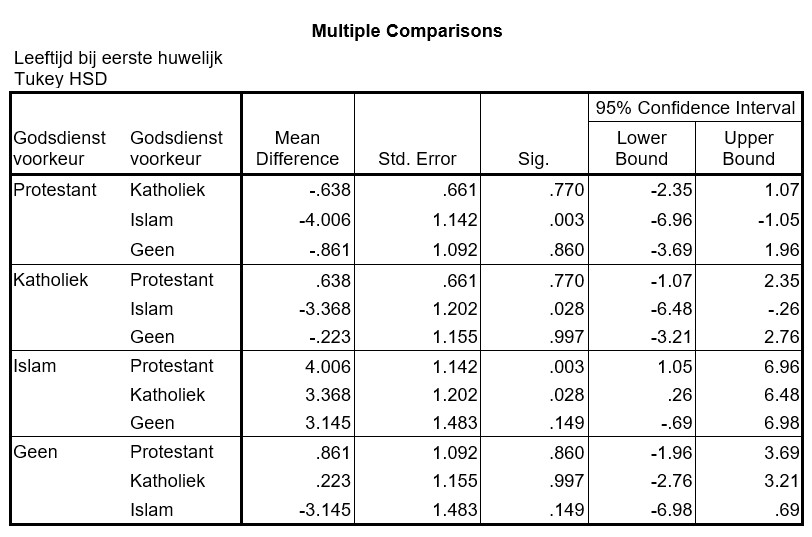

```{r, echo = FALSE, results = "hide"}
include_supplement("uu-Oneway-ANOVA-808-nl-tabel.jpg", recursive = TRUE)
```

```{r, echo = FALSE, results = "hide"}
include_supplement("uu-Oneway-ANOVA-808-nl-tabel2.jpg", recursive = TRUE)
```

Question
========
In een onderzoek naar trouw-leeftijd worden getrouwde mannen gevraagd hoe oud ze waren toen ze (voor het eerst) in het huwelijksbootje stapten. De wetenschapper wil onderzoeken of er verschillen zijn in gemiddelde leeftijd bij eerste huwelijk tussen mannen met verschillende godsdienstelijke voorkeuren: katholiek, protestant, islam, of geen. De SPSS output van de analyse staat hieronder.  



Met een p-waarde van 0.007 kunnen we de conclusie trekken dat er significante verschillen zijn tussen de verschillende godsdienstelijke voorkeursgroepen. SPSS wordt gebruikt om een post-hoc toets te doen. De output staat hieronder.



Welke godsdienstelijke voorkeursgroep levert de grootste bijdrage aan het verwerpen van de H0?
  
Answerlist
----------
* Islam
* Katholiek
* Protestant
* Geen


Solution
========
  


Meta-information
================
exname: uu-Oneway ANOVA-808-nl.Rmd
extype: schoice
exsolution: 1000
exsection: Inferential Statistics/Parametric Techniques/ANOVA/Oneway ANOVA
exextra[Type]: Interpretating output
exextra[Program]: SPSS
exextra[Language]: Dutch
exextra[Level]: Statistical Literacy
