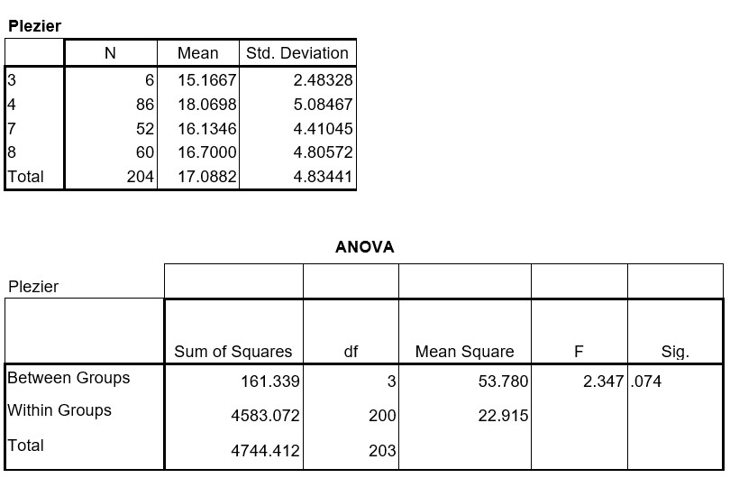

```{r, echo = FALSE, results = "hide"}
include_supplement("uu-Oneway-ANOVA-809-nl-tabel.jpg", recursive = TRUE)
```

Question
========
In a study, a sample of students in grades 3, 4, 7 and 8 of a number of elementary schools were asked a questionnaire with 8 questions measuring school enjoyment. For all questions, there were four response categories where a high score meant enjoyment in going to school. Analysis of variance (ANOVA) was used to examine whether the groups differed in terms of school enjoyment. Tested with $\alpha = .05$. The SPSS output can be found below. 



What is the conclusion based on this output? 
Answerlist
----------
* The groups do not differ significantly in school enjoyment.
* The groups do not differ significantly in school enjoyment, but a post hoc analysis should be conducted to see which groups might differ significantly.
* The groups differ significantly in school fun, children in grade 4 have more fun than the children in the other groups.
* The groups differ significantly in school enjoyment, a post hoc analysis should be conducted to find out which groups differ significantly in school enjoyment. 

Solution
========
  
The analysis of variance test is not significant (nl p = .074 is greater than $\alpha = .05$). So there is no significant difference in mean school enjoyment between boys and girls. NB You perform a post hoc analysis only in a significant variance analysis test, so not here.

Meta-information
================
exname: uu-Oneway ANOVA-809-en
extype: schoice
exsolution: 1000
exsection: Inferential Statistics/Parametric Techniques/ANOVA/Oneway ANOVA
exextra[Type]: Interpretating output
exextra[Program]: SPSS
exextra[Language]: English
exextra[Level]: Statistical Literacy
