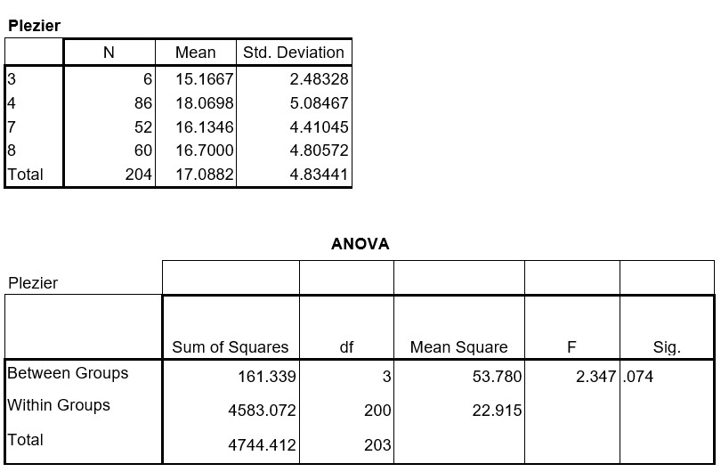

```{r, echo = FALSE, results = "hide"}
include_supplement("uu-Oneway-ANOVA-809-nl-tabel.jpg", recursive = TRUE)
```


Question
========
In een onderzoek is aan een steekproef (sample) van leerlingen van de groepen 3, 4, 7 en 8 van een aantal basisscholen een vragenlijst voorgelegd met 8 vragen die het schoolplezier meten. Bij alle vragen waren er vier antwoordcategorieën waarbij een hoge score betekende dat men plezier had in het naar school gaan. Met behulp van variantie-analyse (ANOVA) is nagegaan of de groepen verschillen in schoolplezier. Getoetst wordt met $\alpha = .05$. De SPSS-output tref je hieronder aan. 



Wat is de conclusie op basis van deze output?
  
Answerlist
----------
* De groepen verschillen niet significant in schoolplezier.
* De groepen verschillen niet significant in schoolplezier, maar een post hoc analyse moet uitgevoerd worden om na te gaan welke groepen wellicht wel significant verschillen. 
* De groepen verschillen significant in schoolplezier, kinderen uit groep 4 hebben meer plezier dan de kinderen in de andere groepen. 
* De groepen verschillen significant in schoolplezier, een posthoc analyse moet uitwijzen welke groepen significant van elkaar verschillen in schoolplezier. 


Solution
========
  
De variantieanalysetoets is niet significant (nl p = .074 is groter dan $\alpha = .05$). Dus er is geen significant verschil in de gemiddelde schoolplezier tussen jongens en meisjes. 
NB Een post hoc analyse voer je alleen uit bij een significante variantieanalysetoets, dus hier niet.


Meta-information
================
exname: uu-Oneway ANOVA-809-nl.Rmd
extype: schoice
exsolution: 1000
exsection: Inferential Statistics/Parametric Techniques/ANOVA/Oneway ANOVA
exextra[ID]: 15ce8
exextra[Type]: Interpretating output
exextra[Program]: SPSS
exextra[Language]: Dutch
exextra[Level]: Statistical Literacy
