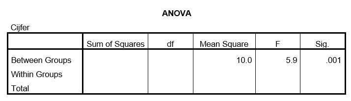

```{r, echo = FALSE, results = "hide"}
include_supplement("uu-Oneway-ANOVA-811-nl-tabel.jpg", recursive = TRUE)
```

Question
========
The grades of 60 students from Utrecht in the MSSWO2 course are compared between four different fields of study. Part of the SPSS output from the analysis is below.



In this study, what is the independent variable? 
Answerlist
----------
* MSSWO2 students from Utrecht
* Study direction
* Grade
* City


Solution
========
  
The above output shows that grade was measured as the dependent variable. Study direction is the independent variable (shown in the description) and this study was conducted among MSSWO2 students in Utrecht (shown in description).

Meta-information
================
exname: uu-Oneway ANOVA-811-en
extype: schoice
exsolution: 0100
exsection: Inferential Statistics/Parametric Techniques/ANOVA/Oneway ANOVA
exextra[Type]: Interpretating output
exextra[Program]: SPSS
exextra[Language]: English
exextra[Level]: Statistical Literacy
