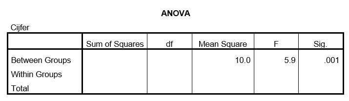

```{r, echo = FALSE, results = "hide"}
include_supplement("uu-Oneway-ANOVA-811-nl-tabel.jpg", recursive = TRUE)
```


Question
========
De cijfers van 60 studenten uit Utrecht in de cursus MSSWO2 worden vergeleken tussen vier verschillende studierichtingen. Een deel van de SPSS output van de analyse staat hieronder.



Wat is in dit onderzoek de onafhankelijke variabele?
  
Answerlist
----------
* MSSWO2 studenten uit Utrecht
* Studierichting 
* Cijfer 
* Stad


Solution
========
  
In de bovenstaande output is te zien dat cijfer als afhankelijke variabele is gemeten.
Studierichting is de onafhankelijke variabele (blijkt uit de beschrijving) en dit onderzoek is uitgevoerd onder MSSWO2-studenten in Utrecht (blijkt uit beschrijving).


Meta-information
================
exname: uu-Oneway ANOVA-811-nl.Rmd
extype: schoice
exsolution: 0100
exsection: Inferential Statistics/Parametric Techniques/ANOVA/Oneway ANOVA
exextra[ID]: 0520a
exextra[Type]: Interpretating output
exextra[Program]: SPSS
exextra[Language]: Dutch
exextra[Level]: Statistical Literacy
