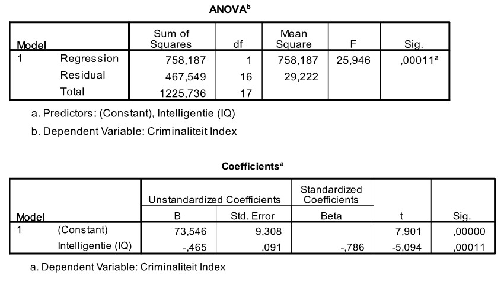

```{r, echo = FALSE, results = "hide"}
include_supplement("uu-Oneway-ANOVA-812-nl-tabel.jpg", recursive = TRUE)
```

Question
========
A psychologist attached to a prison is interested in the relationship between crime and intelligence. A crime index (between 0 and 50) is formulated that takes into account the severity and frequency of crimes committed. Intelligence is measured with a standardized IQ test. Eighteen convicted juveniles participate in this study. SPSS was used to describe the relationship between the two variables. Part of the SPSS output is shown below. 



Below are four statements regarding output, which one is correct ($\alpha= 0.01$)? 
Answerlist
----------
* Intelligence (IQ) is a significant predictor of Crime.
* Intelligence (IQ) is not a significant predictor of Crime.
* Crime is a significant predictor of Intelligence (IQ).
* Crime is not a significant predictor of Intelligence (IQ).

Solution
========
  
Intelligence (IQ) is a significant predictor of Crime, p = .00011.

Meta-information
================
exname: uu-Oneway ANOVA-812-en
extype: schoice
exsolution: 1000
exsection: Inferential Statistics/Parametric Techniques/ANOVA/Oneway ANOVA
exextra[ID]: 2ade5
exextra[Type]: Interpretating output
exextra[Program]: SPSS
exextra[Language]: English
exextra[Level]: Statistical Literacy
