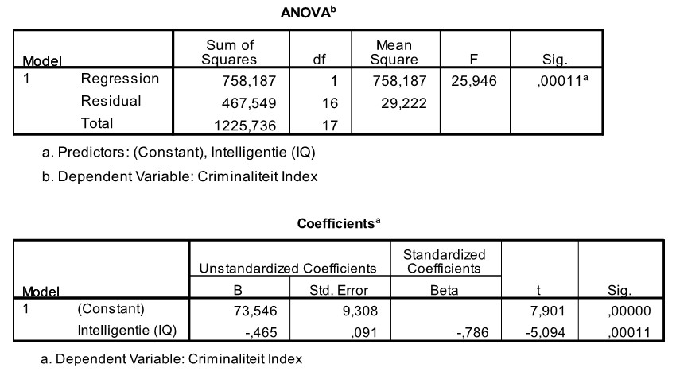

```{r, echo = FALSE, results = "hide"}
include_supplement("uu-Oneway-ANOVA-812-nl-tabel.jpg", recursive = TRUE)
```


Question
========
Een psycholoog verbonden aan een gevangenis is geïnteresseerd in de relatie tussen criminaliteit en intelligentie. Een criminaliteitsindex (tussen 0 en 50) wordt geformuleerd die rekening houdt met de zwaarte en de frequentie van de gepleegde misdrijven. Intelligentie wordt gemeten met een gestandaardiseerde IQ test. Achttien veroordeelde jongeren doen mee met dit onderzoek. SPSS is gebruikt om de relatie tussen de twee variabelen te beschrijven. Een deel van de SPSS output is hieronder te zien. 



Hieronder staan vier beweringen met betrekking tot de output, welke is juist ($\alpha= 0.01$)?
  
Answerlist
----------
* Intelligentie (IQ) is een significante voorspeller van Criminaliteit. 
* Intelligentie (IQ) is geen significant voorspeller van Criminaliteit.
* Criminaliteit is een significante voorspeller van Intelligentie (IQ).
* Criminaliteit is geen significante voorspeller van Intelligentie (IQ).


Solution
========
  
Intelligentie (IQ)  is een significante voorspeller van Criminaliteit, p = .00011.


Meta-information
================
exname: uu-Oneway ANOVA-812-nl.Rmd
extype: schoice
exsolution: 1000
exsection: Inferential Statistics/Parametric Techniques/ANOVA/Oneway ANOVA
exextra[ID]: f4326
exextra[Type]: Interpretating output
exextra[Program]: SPSS
exextra[Language]: Dutch
exextra[Level]: Statistical Literacy
