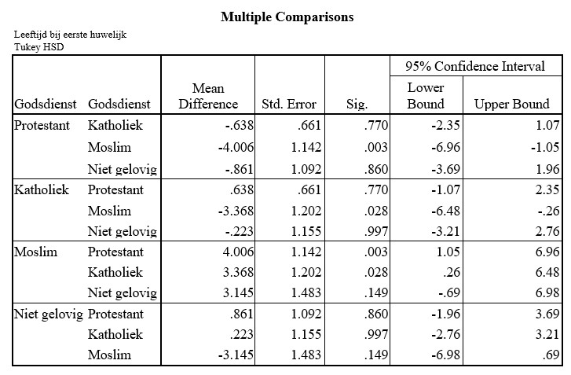

```{r, echo = FALSE, results = "hide"}
include_supplement("uu-Oneway-ANOVA-813-nl-tabel.jpg", recursive = TRUE)
```

Question
========
  
Based on statistical analysis, it is concluded that the mean age at first marriage consummation differs significantly (alpha = 5%) between groups with different religious beliefs (Muslim, Catholic, Protestant, Nonbeliever). The results of the post-hoc test are below.



What conclusion is justified when testing (alpha = 5%) the pairwise differences between groups? 
Answerlist
----------
* The group of Nonbelievers differs significantly from the group of Protestants.
* The group of Nonbelievers differs significantly from the group of Muslims.
* The group of Protestants differs significantly from the group of Catholics.
* The group of Protestants differs significantly from the group of Muslims.


Solution
========

Meta-information
================
exname: uu-Oneway ANOVA-813-en
extype: schoice
exsolution: 0001
exsection: Inferential Statistics/Parametric Techniques/ANOVA/Oneway ANOVA
exextra[ID]: 71466
exextra[Type]: Interpretating output
exextra[Program]: SPSS
exextra[Language]: English
exextra[Level]: Statistical Literacy
