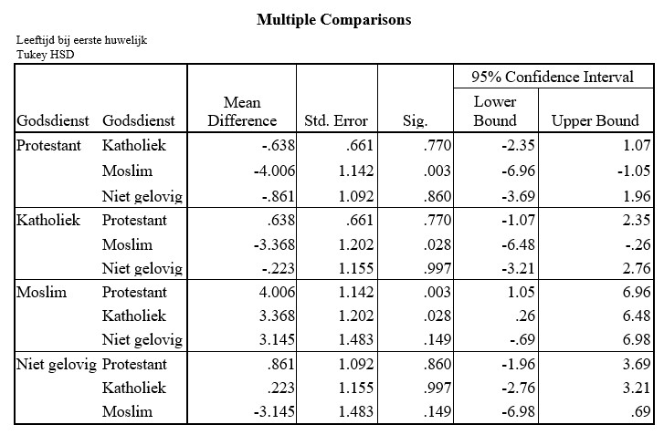

```{r, echo = FALSE, results = "hide"}
include_supplement("uu-Oneway-ANOVA-813-nl-tabel.jpg", recursive = TRUE)
```


Question
========
  
Op basis van een statistische analyse wordt de conclusie getrokken dat de gemiddelde leeftijd bij het voltrekken van het eerste huwelijk significant (alpha = 5%) verschilt tussen groepen met een verschillende geloofsovertuiging (Moslim, Katholiek, Protestant, Niet gelovig). De resultaten van de post-hoc toetsing staan hieronder.



Welke conclusie is terecht bij toetsing (alpha = 5%) van de paarsgewijze verschillen tussen de groepen?
  
Answerlist
----------
* De groep Niet gelovigen verschilt significant van de groep Protestanten.
* De groep Niet gelovigen verschilt significant van de groep Moslims.
* De groep Protestanten verschilt significant van de groep Katholieken.
* De groep Protestanten verschilt significant van de groep Moslims.


Solution
========
  

Answerlist
----------


Meta-information
================
exname: uu-Oneway ANOVA-813-nl.Rmd
extype: schoice
exsolution: 0001
exsection: Inferential Statistics/Parametric Techniques/ANOVA/Oneway ANOVA
exextra[Type]: Interpretating output
exextra[Program]: SPSS
exextra[Language]: Dutch
exextra[Level]: Statistical Literacy
