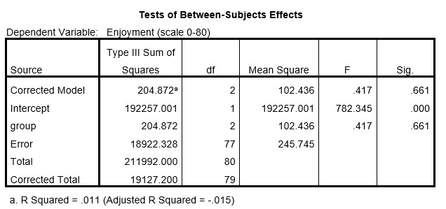

```{r, echo = FALSE, results = "hide"}
include_supplement("uu-Oneway-ANOVA-816-nl-tabel.jpg", recursive = TRUE)
```

Question
========
  




We see that there are no significant differences between the three experimental groups. In addition to the p-value, we can use another value from the table above to determine that we are dealing with a non-significant result. TRUE value is that?

  
Answerlist
----------
* Fgroup < 1
* SSError ≈ SSTotal
* MSgroup > 100
* R2 ≈ 1%


Solution
========

Meta-information
================
exname: uu-Oneway ANOVA-816-en
extype: schoice
exsolution: 1000
exsection: Inferential Statistics/Parametric Techniques/ANOVA/Oneway ANOVA
exextra[ID]: b2469
exextra[Type]: Interpretating output
exextra[Program]: SPSS
exextra[Language]: English
exextra[Level]: Statistical Literacy
