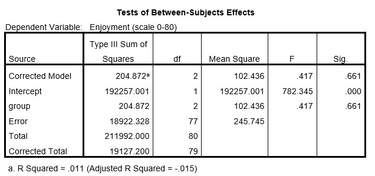

```{r, echo = FALSE, results = "hide"}
include_supplement("uu-Oneway-ANOVA-816-nl-tabel.jpg", recursive = TRUE)
```


Question
========
  




We zien dat er geen significante verschillen zijn tussen de drie experimentele groepen. 
Naast de p-waarde kunnen we uit bovenstaande tabel nog een waarde gebruiken  om te bepalen dat we te maken hebben met een niet significant resultaat. Welke waarde is dat?

  
Answerlist
----------
* Fgroup < 1 
* SSError ≈ SSTotal
* MSgroup > 100
* R2 ≈ 1%


Solution
========
  


Meta-information
================
exname: uu-Oneway ANOVA-816-nl.Rmd
extype: schoice
exsolution: 1000
exsection: Inferential Statistics/Parametric Techniques/ANOVA/Oneway ANOVA
exextra[ID]: e9e4c
exextra[Type]: Interpretating output
exextra[Program]: SPSS
exextra[Language]: Dutch
exextra[Level]: Statistical Literacy
