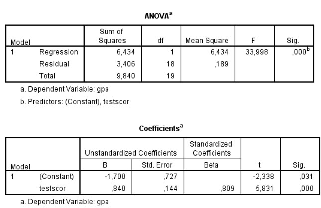

```{r, echo = FALSE, results = "hide"}
include_supplement("uu-Oneway-ANOVA-817-nl-tabel.jpg", recursive = TRUE)
```

Question
========
  
The GPAs (Grade Point Average = average grade across all subjects) of American high school students are predicted from entrance exam scores (the test score variable). Part of the SPSS output from the regression analysis is below. 



TRUE is the predicted GPA value for students with an admissions exam score of 5.5? 
Answerlist
----------
* 5.83
* 4.62
* 4.45
* 2.92


Solution
========
ŷ (GPA) = a + b * X = - 1.700 + 0.840 x entrance exam score = - 1.700 + 0.840 x 5.5 = 2.92

The remaining answers have computational errors: Option 2: Here Beta instead of B was used when filling in the regression equation (0.809 instead of 0.840). Option 3: Here the constant has been forgotten (so not -1.700 done) Option 4: Here the t-value was chosen as the predicted value

Meta-information
================
exname: uu-Oneway ANOVA-817-en
extype: schoice
exsolution: 0001
exsection: Inferential Statistics/Parametric Techniques/ANOVA/Oneway ANOVA
exextra[Type]: Interpretating output
exextra[Program]: SPSS
exextra[Language]: English
exextra[Level]: Statistical Literacy
