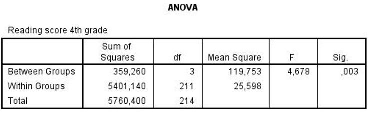

```{r, echo = FALSE, results = "hide"}
include_supplement("uu-Oneway-ANOVA-819-nl-tabel.jpg", recursive = TRUE)
```

Question
========
  
Several schools in inner-city New York use different methods for teaching reading to children in grades 2 through 4 (each school has its own method). At the end of grade 4, the children's reading scores are determined and compared across schools. Some of the SPSS output is shown below. 



What is the independent variable in this study? 
Answerlist
----------
* Schools
* Classes
* New York neighborhoods
* Reading skills


Solution
========

Meta-information
================
exname: uu-Oneway ANOVA-819-en
extype: schoice
exsolution: 1000
exsection: Inferential Statistics/Parametric Techniques/ANOVA/Oneway ANOVA
exextra[ID]: 403ec
exextra[Type]: Interpretating output
exextra[Program]: SPSS
exextra[Language]: English
exextra[Level]: Statistical Literacy
