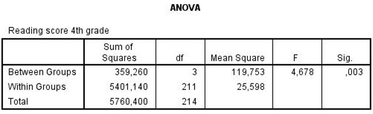

```{r, echo = FALSE, results = "hide"}
include_supplement("uu-Oneway-ANOVA-819-nl-tabel.jpg", recursive = TRUE)
```


Question
========
  
Op verschillende scholen in de binnenstad van New York worden verschillende methodes gebruikt voor het leesonderwijs van de kinderen in groepen 2 t/m 4 (elke school heeft z’n eigen methode). Aan het eind van groep 4 worden de leesvaardigheidscores van de kinderen bepaald en vergeleken tussen de scholen. Een deel van de SPSS output staat hieronder. 



Wat is de onafhankelijke variabele in dit onderzoek?
  
Answerlist
----------
* Scholen 
* Klassen
* Wijken in New York
* Leesvaardigheid


Solution
========
  


Meta-information
================
exname: uu-Oneway ANOVA-819-nl.Rmd
extype: schoice
exsolution: 1000
exsection: Inferential Statistics/Parametric Techniques/ANOVA/Oneway ANOVA
exextra[ID]: 972bc
exextra[Type]: Interpretating output
exextra[Program]: SPSS
exextra[Language]: Dutch
exextra[Level]: Statistical Literacy
