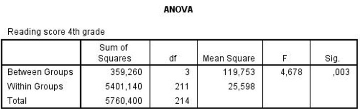

```{r, echo = FALSE, results = "hide"}
include_supplement("uu-Oneway-ANOVA-820-nl-tabel.jpg", recursive = TRUE)
```


Question
========
  
Op verschillende scholen in de binnenstad van New York worden verschillende methodes gebruikt voor het leesonderwijs van de kinderen in groepen 2 t/m 4 (elke school heeft z’n eigen methode). Aan het eind van groep 4 worden de leesvaardigheidscores van de kinderen bepaald en vergeleken tussen de scholen. Een deel van de SPSS output staat hieronder. 



Omdat de resultaten significant zijn, wil de onderzoeker de effectgrootte rapporteren. Wat is de waarde van de effectgrootte van deze toets?
  
Answerlist
----------
* 4.7%
* 6.2% 
* 93.8%
* 95.3%


Solution
========
  


Meta-information
================
exname: uu-Oneway ANOVA-820-nl.Rmd
extype: schoice
exsolution: 0100
exsection: Inferential Statistics/Parametric Techniques/ANOVA/Oneway ANOVA
exextra[Type]: Interpretating output
exextra[Program]: SPSS
exextra[Language]: Dutch
exextra[Level]: Statistical Literacy
