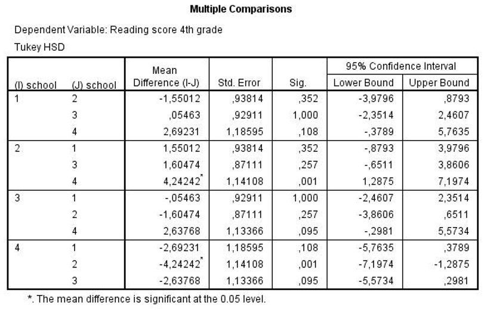

```{r, echo = FALSE, results = "hide"}
include_supplement("uu-Oneway-ANOVA-821-nl-tabel.jpg", recursive = TRUE)
```

Question
========
  
Several schools in inner-city New York use different methods for teaching reading to children in grades 2 through 4 (each school has its own method). At the end of grade 4, the children's reading scores are determined and compared across schools. Some of the SPSS output is shown below. 



Which schools are significantly different from each other at an alpha of .05? 
Answerlist
----------
* Schools 1 & 3
* Schools 2 & 4
* Schools 1 & 2, 1 & 3, 1 & 4, 2 & 3 and Schools 3 & 4
* Schools 1 & 4

Solution
========

Meta-information
================
exname: uu-Oneway ANOVA-821-en
extype: schoice
exsolution: 0100
exsection: Inferential Statistics/Parametric Techniques/ANOVA/Oneway ANOVA
exextra[ID]: 7c017
exextra[Type]: Interpretating output
exextra[Program]: SPSS
exextra[Language]: English
exextra[Level]: Statistical Literacy
