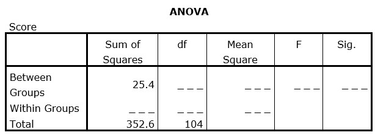

```{r, echo = FALSE, results = "hide"}
include_supplement("uu-Oneway-ANOVA-822-nl-tabel.jpg", recursive = TRUE)
```


Question
========
  
Hieronder staat een incomplete ANOVA-tabel voor het vergelijken van de gemiddelde scores van vier groepen. Hoe groot is de F-ratio en is het resultaat significant bij toetsing met $\alpha$ = .01?




Answerlist
----------
* F = 2.6 en is significant bij $\alpha$ = .01 
* F = 2.6 en is niet significant bij $\alpha$  = .01 
* F = 1.9 en is significant bij $\alpha$ = .01
* F = 1.9 en is niet significant bij $\alpha$ = .01 


Solution
========
SSwithin = SStotal – SSbetween = 352.6-25.4 = 327.2
dfbetween = k – 1 = 4 – 1 = 3
dfwithin = dftotal - dfbetween  = 104 – 3 = 101.

MSbetween = SSbetween / dfbetween 25.4/3 = 8.47
MSwithin = SSwithin / dfwithin =  327.2/101 = 3.24

F = MSbetween/ MSwithin = 8.47/3.24 = 2.6

Fkritiek bij df 3, 100 (101 staat er niet in, dus kijken we bij 100) bij = .01 is 3.98. De verkregen F-waarde is lager dan Fkritiek, dus het resultaat is niet significant bij  = .01.
Wanneer je de df verkeerd bepaald kom je uit op F = 1.9 (dfbetween = 4 en dfwithin = 100)
  


Meta-information
================
exname: uu-Oneway ANOVA-822-nl.Rmd
extype: schoice
exsolution: 0100
exsection: Inferential Statistics/Parametric Techniques/ANOVA/Oneway ANOVA
exextra[Type]: Interpretating output
exextra[Program]: SPSS
exextra[Language]: Dutch
exextra[Level]: Statistical Literacy
