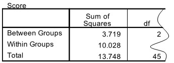

```{r, echo = FALSE, results = "hide"}
include_supplement("uu-Oneway-ANOVA-823-nl-tabel.jpg", recursive = TRUE)
```

Question
========

The Cognitive Failure Questionnaire uses 25 questions to measure the subjective evaluation of one's own cognitive abilities: it is concerned with the extent to which people have recently suffered from daily mistakes. Mean scores (averaged over the 25 questions) are calculated for three groups of elderly people: elderly people living independently at home without a partner, elderly people living independently at home with a partner, and elderly people living in assisted living facilities. To see if there are differences between these three groups of elderly, SPSS was used.

Unfortunately, the output is torn. The remaining piece is below. 




What is the value of the test quantity of this test? 
Answerlist
----------
* 7.97
* 1.86
* 0.37
* 6.09


Solution
========

Meta-information
================
exname: uu-Oneway ANOVA-823-en
extype: schoice
exsolution: 1000
exsection: Inferential Statistics/Parametric Techniques/ANOVA/Oneway ANOVA
exextra[ID]: 39153
exextra[Type]: Interpretating output
exextra[Program]: SPSS
exextra[Language]: English
exextra[Level]: Statistical Literacy
