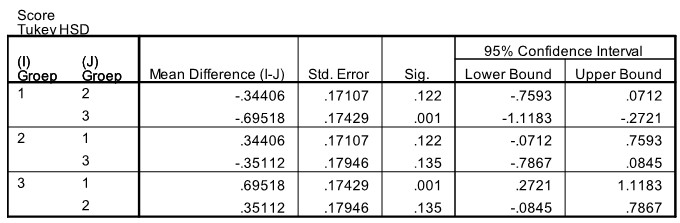

```{r, echo = FALSE, results = "hide"}
include_supplement("uu-Oneway-ANOVA-824-nl-tabel.jpg", recursive = TRUE)
```

Question
========

The Cognitive Failure Questionnaire uses 25 questions to measure the subjective evaluation of one's own cognitive abilities: it is concerned with the extent to which people have recently suffered from daily mistakes. Mean scores (averaged over the 25 questions) are calculated for three groups of elderly people: elderly people living independently at home without a partner, elderly people living independently at home with a partner, and elderly people living in assisted living facilities. To see if there are differences between these three groups of elderly, SPSS was used.

The p-value of the test was less than 5%. A Tukey's post hoc test was chosen. Part of the SPSS output is shown below.




Which groups are significantly different from each other? 
Answerlist
----------
* Groups 1 & 2
* Groups 1 & 3
* Groups 1 & 3 and groups 2 & 3
* Groups 1 & 2 and groups 2 & 3

Solution
========

Meta-information
================
exname: uu-Oneway ANOVA-824-en
extype: schoice
exsolution: 0100
exsection: Inferential Statistics/Parametric Techniques/ANOVA/Oneway ANOVA
exextra[Type]: Interpretating output
exextra[Program]: SPSS
exextra[Language]: English
exextra[Level]: Statistical Literacy
