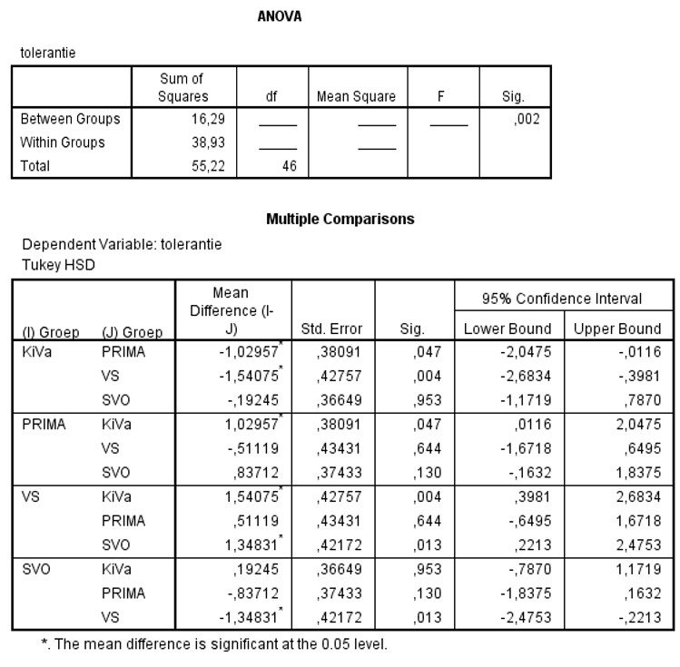

```{r, echo = FALSE, results = "hide"}
include_supplement("uu-Oneway-ANOVA-827-nl-tabel.jpg", recursive = TRUE)
```

Question
========
  
Several programs are used in elementary schools to teach children how to get along with each other and to make them aware of the consequences of bullying. Four of these programs were compared in a recent study:
- KiVa -- an anti-bullying program from Finland
- PRIMA -- PRoefImpleMentation Anti-Bullying Policy in Primary Education
- VS - Peaceful School
- SVO - Safe Education Foundation A measure of mutual tolerance was used as an indication of program effectiveness. Part of the SPSS output is below. 



The post hoc tests showed that there were significant differences between . . . 
Answerlist
----------
* (KiVa & VS) and (SVO & VS).
* (KiVa & PRIMA), (KiVa & VS), (PRIMA & SVO) and (SVO & VS).
* (KiVa & SVO), (PRIMA & VS) and (PRIMA & SVO).
* (KiVa & PRIMA), (KiVa & VS) and (SVO & VS).

Solution
========
You can look at the pairs where 0 is not in the 95% confidence interval or where the p-value is less than $\alpha$ = .05. NOTE For (KiVa & SVO), (PRIMA & SVO) and (PRIMA & VS), the p-value (= "Sig.") is greater than .10 and thus there is no significant difference for those pairs. For (KiVa & PRIMA), (KiVa & VS) and (SVO & VS), the p-value (= "Sig.") is less than .10 and thus there is a significant difference for each of those pairs.

Answerlist
----------
* Only (KiVa & PRIMA) and (KiVa & VS) Indeed, in both comparisons, 0 does not lie in the 95% confidence interval and thus there is a significant difference, but there is another interval in which 0 does not lie.
* Only (KiVa & SVO) and (PRIMA & VS) In both comparisons, 0 does lie in the 95% confidence interval and thus there is a non-significant result.
* (KiVa & SVO), (PRIMA & SVO) and (PRIMA & VS) In all three comparisons, 0 does lie in the 95% confidence interval and is therefore a non-significant result.
* (KiVa & PRIMA), (KiVa & VS) and (SVO & VS) Indeed, in all three comparisons, 0 is not in the 95% confidence interval and thus there is a significant difference.

Meta-information
================
exname: uu-Oneway ANOVA-827-en
extype: schoice
exsolution: 0001
exsection: Inferential Statistics/Parametric Techniques/ANOVA/Oneway ANOVA
exextra[Type]: Interpretating output
exextra[Program]: SPSS
exextra[Language]: English
exextra[Level]: Statistical Literacy
