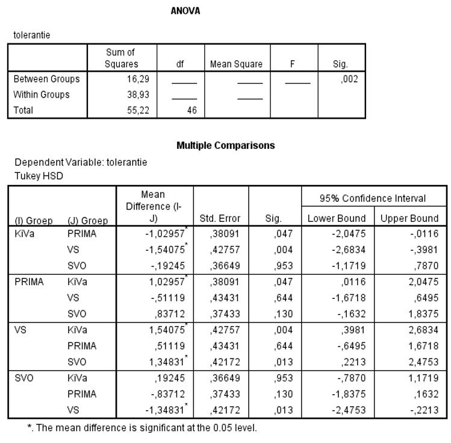

```{r, echo = FALSE, results = "hide"}
include_supplement("uu-Oneway-ANOVA-827-nl-tabel.jpg", recursive = TRUE)
```


Question
========
  
Op basisscholen worden verschillende programma’s gebruikt om kinderen met elkaar om te leren gaan en ze op de gevolgen van pesten te wijzen. Vier van deze programma’s werden in een recent onderzoek met elkaar vergeleken:
• KiVa – een antipestprogramma uit Finland
• PRIMA -- PRoefImpleMentatie Antipestbeleid in het basisonderwijs
• VS – Vreedzame School
• SVO – Stichting Veilig Onderwijs
Een maat van onderlinge tolerantie werd gebruikt als indicatie van de effectiviteit van het programma. Een deel van de SPSS output staat hieronder. 




Uit de post-hoc toetsen blijkt dat er significante verschillen waren tussen . . . 
  
Answerlist
----------
* (KiVa & VS) en (SVO & VS).
* (KiVa & PRIMA), (KiVa & VS), (PRIMA & SVO) en (SVO & VS) 
* (KiVa & SVO), (PRIMA & VS) en (PRIMA & SVO).
* (KiVa & PRIMA), (KiVa & VS) en (SVO & VS).


Solution
========
Je kan kijken naar de paren waar 0 niet in het 95% betrouwbaarheidsinterval ligt of daar waar de p-waarde lager is dan $\alpha$ = .05. 
NB Bij (KiVa & SVO), (PRIMA & SVO) en (PRIMA & VS) is de p-waarde (= “Sig.”) groter dan .10 en is er dus voor die paren geen significant verschil.
Bij (KiVa & PRIMA), (KiVa & VS) en (SVO & VS) is de p-waarde (= “Sig.”) kleiner dan .10 en is er dus sprake van een significant verschil voor elk van die paren.


Answerlist
----------
* alleen (KiVa & PRIMA) en (KiVa & VS) In beide vergelijkingen ligt 0 inderdaad niet in het 95% betrouwbaarheidsinterval en is er dus sprake van een significant verschil, maar er is nog een interval waar 0 niet in ligt.
* alleen (KiVa & SVO) en (PRIMA & VS) In beide vergelijkingen ligt 0 wél in het 95% betrouwbaarheidsinterval en is er dus sprake van een niet significant resultaat.
* (KiVa & SVO), (PRIMA & SVO) en (PRIMA & VS) In alledrie de vergelijkingen ligt 0 wél in het 95% betrouwbaarheidsinterval en is er dus sprake van een niet significant resultaat.
* (KiVa & PRIMA), (KiVa & VS) en (SVO & VS) In alledrie de vergelijkingen ligt 0 inderdaad niet in het 95% betrouwbaarheidsinterval en is er dus sprake van een significant verschil.


Meta-information
================
exname: uu-Oneway ANOVA-827-nl.Rmd
extype: schoice
exsolution: 0001
exsection: Inferential Statistics/Parametric Techniques/ANOVA/Oneway ANOVA
exextra[ID]: 2225a
exextra[Type]: Interpretating output
exextra[Program]: SPSS
exextra[Language]: Dutch
exextra[Level]: Statistical Literacy
