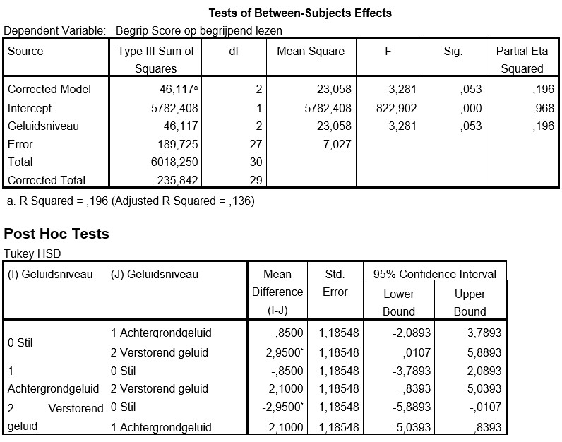

```{r, echo = FALSE, results = "hide"}
include_supplement("uu-Oneway-ANOVA-828-nl-tabel.jpg", recursive = TRUE)
```


Question
========
  
In de examentijd is er veel aandacht voor de vraag hoe je het beste kunt concentreren op het bestuderen van de opgegeven stof. Onder andere wordt de vraag gesteld of je beter kunt leren in een hele stille omgeving, of juist in een omgeving met wat achtergrondgeluid. In dit onderzoek zijn studenten ingedeeld in drie groepen van elk 10 studenten. De eerste groep moest een toets over begrijpend lezen uitvoeren in een stille omgeving, de tweede in een omgeving met wat achtergrondgeluiden, en de derde groep moest de toets maken naast een ruimte waar verbouwd werd. Hieronder vind je het resultaat van de variantie-analyse. 




Wat is de conclusie bij toetsing met een significantieniveau van 5%?
  
Answerlist
----------
* De groepen verschillen niet significant van elkaar in hun score op begrijpend lezen.
* Er zijn significante verschillen tussen de gemiddelden. Het verschil tussen de groep in een stille ruimte en de groep met verstorend geluid is significant.
* Er zijn significante verschillen tussen de gemiddelden. de verschillen tussen de groepen in een stille ruimte en met achtergrondgeluid, en de groepen met achtergrondgeluid en verstorend geluid zijn significant.
* Er zijn significante verschillen tussen de gemiddelden. Alle drie de gemiddelden verschillen significant van elkaar.


Solution
========
De F-toets van de ANOVA geeft aan dat er geen significant effect is van geluidsniveau bij een alphaniveau van 5%. Dus daarom verschillen de groepen niet significant van elkaar.
Pas als de F-toets voor een factor significant is, kijk je naar de POST-HOC toetsen.


Answerlist
----------


Meta-information
================
exname: uu-Oneway ANOVA-828-nl.Rmd
extype: schoice
exsolution: 1000
exsection: Inferential Statistics/Parametric Techniques/ANOVA/Oneway ANOVA
exextra[Type]: Interpretating output
exextra[Program]: SPSS
exextra[Language]: Dutch
exextra[Level]: Statistical Literacy
