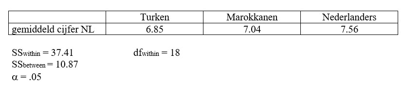

```{r, echo = FALSE, results = "hide"}
include_supplement("uu-Oneway-ANOVA-832-nl-graph01.jpg", recursive = TRUE)
```
Question
========
One wants to see if the final grade on the Dutch language exam at MBO differs between three different ethnic groups: Turks, Moroccans and Dutch. Below are the data.



What is the correct conclusion?

Answerlist
----------
* $F_{obt}$ < $F_{crit}$, $H_{0}$ is rejected.
* $F_{obt}$ < $F_{crit}$, $H_{0}$ is not rejected.
* $F_{obt}$ > $F_{crit}$, $H_{0}$ is rejected.
* $F_{obt}$ > $F_{crit}$, $H_{0}$ is not rejected.


Solution
========

Meta-information
================
exname: uu-Oneway ANOVA-832-en
extype: schoice
exsolution: 0100
exsection: Inferential Statistics/Parametric Techniques/ANOVA/Oneway ANOVA
exextra[Type]: Interpretating output
exextra[Program]: 
exextra[Language]: English
exextra[Level]: Statistical Reasoning