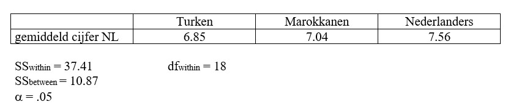

```{r, echo = FALSE, results = "hide"}
include_supplement("uu-Oneway-ANOVA-832-nl-graph01.jpg", recursive = TRUE)
```
Question
========
Men wil kijken of het eindcijfer op het examen Nederlands op het MBO verschilt tussen drie verschillende etnische groepen: Turken, Marokkanen en Nederlanders. Hieronder staan de gegevens.



Wat is de correcte conclusie?

Answerlist
----------
* $F_{obt}$ < $F_{crit}$, $H_{0}$ wordt verworpen.
* $F_{obt}$ < $F_{crit}$, $H_{0}$ wordt niet verworpen.
* $F_{obt}$ > $F_{crit}$, $H_{0}$ wordt verworpen.
* $F_{obt}$ > $F_{crit}$, $H_{0}$ wordt niet verworpen.


Solution
========


Meta-information
================
exname: uu-Oneway ANOVA-832-nl
extype: schoice
exsolution: 0100
exsection: Inferential Statistics/Parametric Techniques/ANOVA/Oneway ANOVA
exextra[ID]: 1c185
exextra[Type]: Interpretating output
exextra[Program]: 
exextra[Language]: Dutch
exextra[Level]: Statistical Reasoning