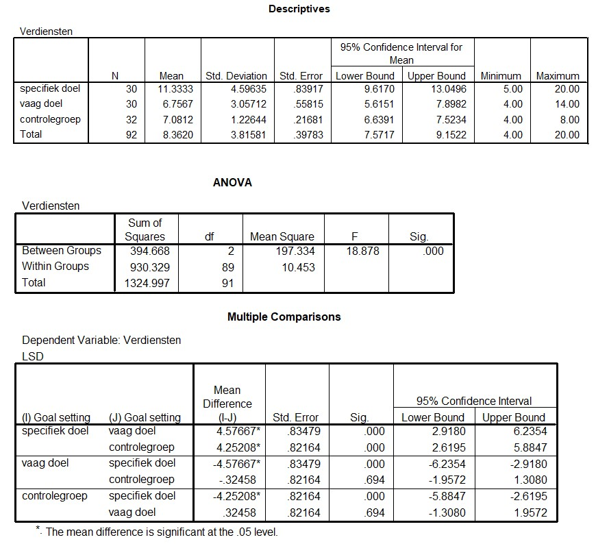

```{r, echo = FALSE, results = "hide"}
include_supplement("uu-Oneway-ANOVA-833-nl-graph01.jpg", recursive = TRUE)
```
Question
========
Below are the output tables associated with Punnett's research. 



What is the conclusion in Punnett's research when tested with $/alpha$ = 5%?

Answerlist
----------
* The averages of the groups are all significantly different from each other....
* The group that received a vague goal scores significantly higher than the group that received a specific goal, but significantly lower than the control group.
* The control group scored significantly higher than the group that was given a vague goal, but significantly lower than the group that was given a specific goal.
* The group that received a specific goal scored significantly higher than the groups that received a vague goal and the control group.


Solution
========

Meta-information
================
exname: uu-Oneway ANOVA-833-en
extype: schoice
exsolution: 0001
exsection: Inferential Statistics/Parametric Techniques/ANOVA/Oneway ANOVA
exextra[ID]: 051c1
exextra[Type]: Interpretating output
exextra[Program]: SPSS
exextra[Language]: English
exextra[Level]: Statistical Reasoning