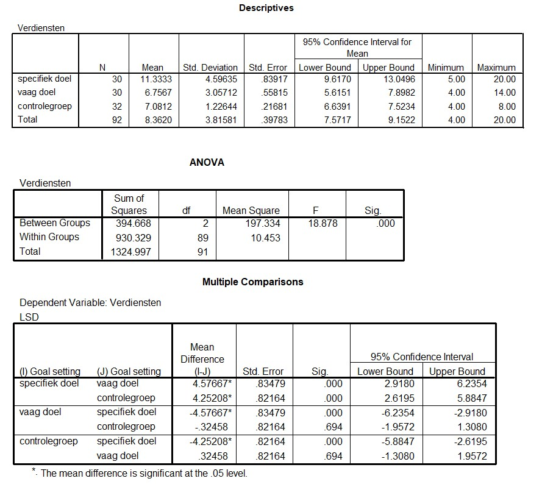

```{r, echo = FALSE, results = "hide"}
include_supplement("uu-Oneway-ANOVA-833-nl-graph01.jpg", recursive = TRUE)
```
Question
========
Hieronder staan de outputtabellen die horen bij het onderzoek van Punnett. 



Wat is de conclusie in het onderzoek van Punnett als getoetst wordt met $/alpha$ = 5%?

Answerlist
----------
* De gemiddelden van de groepen verschillen allemaal significant van elkaar..
* De groep die een vaag doel kreeg, scoort significant hoger dan de groep die een specifiek doel kreeg, maar significant lager dan de controlegroep.
* De controlegroep scoort significant hoger dan de groep die een vaag doel kreeg, maar significant lager dan de groep die een specifiek doel kreeg.
* De groep die een specifiek doel kreeg, scoort significant hoger dan de groepen die een vaag doel kregen en de controlegroep.


Solution
========


Meta-information
================
exname: uu-Oneway ANOVA-833-nl
extype: schoice
exsolution: 0001
exsection: Inferential Statistics/Parametric Techniques/ANOVA/Oneway ANOVA
exextra[Type]: Interpretating output
exextra[Program]: SPSS
exextra[Language]: Dutch
exextra[Level]: Statistical Reasoning