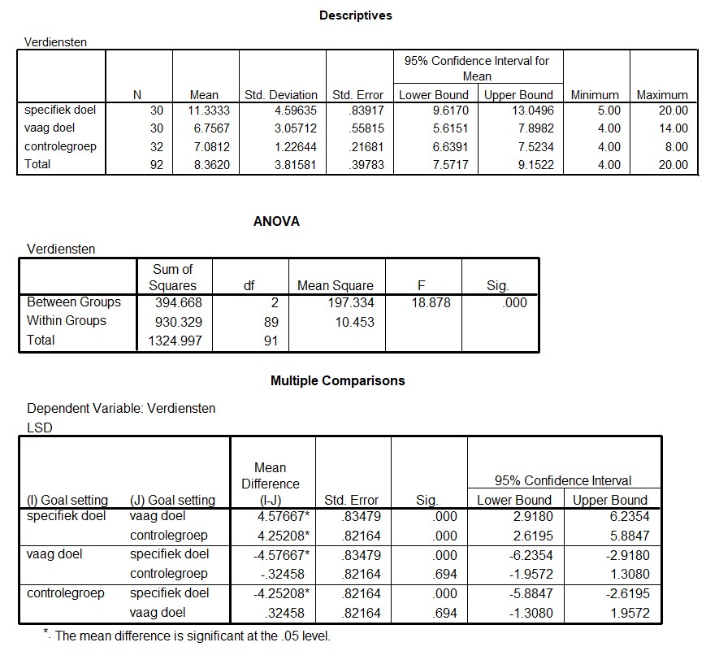

```{r, echo = FALSE, results = "hide"}
include_supplement("uu-Oneway-ANOVA-834-nl-graph01.jpg", recursive = TRUE)
```
Question
========
Below are the output tables associated with Punnett's research.



The researchers are interested in the strength of the effect of "goal setting. What percentage of the variance in earnings is explained by this variable?

Answerlist
----------
* .11
* .13
* .28
* .68


Solution
========

Meta-information
================
exname: uu-Oneway ANOVA-834-en
extype: schoice
exsolution: 0010
exsection: Inferential Statistics/Parametric Techniques/ANOVA/Oneway ANOVA
exextra[Type]: Interpretating output
exextra[Program]: 
exextra[Language]: English
exextra[Level]: Statistical Reasoning