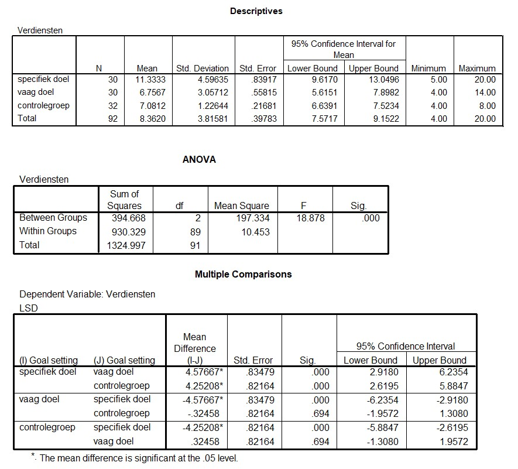

```{r, echo = FALSE, results = "hide"}
include_supplement("uu-Oneway-ANOVA-834-nl-graph01.jpg", recursive = TRUE)
```
Question
========
Hieronder staan de outputtabellen die horen bij het onderzoek van Punnett.



De onderzoekers zijn geïnteresseerd in de sterkte van het effect van ‘het stellen van een doel’. Hoeveel procent van de variantie in de verdiensten wordt verklaard door deze variabele?

Answerlist
----------
* .11
* .13
* .28
* .68


Solution
========


Meta-information
================
exname: uu-Oneway ANOVA-834-nl
extype: schoice
exsolution: 0010
exsection: Inferential Statistics/Parametric Techniques/ANOVA/Oneway ANOVA
exextra[Type]: Interpretating output
exextra[Program]: 
exextra[Language]: Dutch
exextra[Level]: Statistical Reasoning