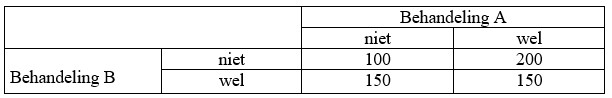

```{r, echo = FALSE, results = "hide"}
include_supplement("uu-Oneway-ANOVA-835-nl-tabel.jpg", recursive = TRUE)
```

Question
========
A study is being conducted on the effect of two types of treatment (A and B) and the effect, if any, of a combination of the two treatments. The dependent variable is the number of complaints ended in week. Four equally sized groups are randomly formed.

What type of effect is visible in the table below? (Note: the numbers represent group averages).




Answerlist
----------
* A main effect for treatment B and an interaction effect
* A main effect for treatment A and an interaction effect
* An interaction effect only
* A main effect for both treatment A and B


Solution
========

Meta-information
================
exname: uu-Oneway ANOVA-835-en
extype: schoice
exsolution: 0100
exsection: Inferential Statistics/Parametric Techniques/ANOVA/Oneway ANOVA
exextra[Type]: Interpretating graph
exextra[Program]: SPSS
exextra[Language]: English
exextra[Level]: Statistical Literacy