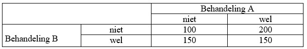

```{r, echo = FALSE, results = "hide"}
include_supplement("uu-Oneway-ANOVA-835-nl-tabel.jpg", recursive = TRUE)
```


Question
========
Er wordt een onderzoek gedaan naar het effect van twee soorten behandeling (A en B) 
en het eventuele effect van een combinatie van de twee behandelingen. De afhankelijke 
variabele is het aantal klachten afgelopen in week. Er worden aselect 4 even grote groepen 
gevormd.

Welk soort effect is in onderstaande tabel zichtbaar? (N.B. de getallen staan voor groepsgemiddelden).




Answerlist
----------
* een hoofdeffect voor behandeling B en een interactie-effect
* een hoofdeffect voor behandeling A en een interactie-effect
* alleen een interactie-effect
* een hoofdeffect voor zowel behandeling A als B


Solution
========


Meta-information
================
exname: uu-Oneway ANOVA-835-nl
extype: schoice
exsolution: 0100
exsection: Inferential Statistics/Parametric Techniques/ANOVA/Oneway ANOVA
exextra[ID]: 69e61
exextra[Type]: Interpretating graph
exextra[Program]: SPSS
exextra[Language]: Dutch
exextra[Level]: Statistical Literacy