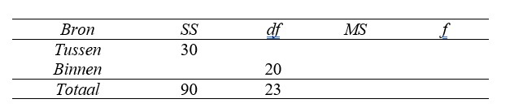

```{r, echo = FALSE, results = "hide"}
include_supplement("uu-Oneway-ANOVA-841-nl-graph01.jpg", recursive = TRUE)
```
Question
========
From a study, the result is partially presented in the ANOVA table below.



This shows that:

Answerlist
----------
* The result found is significant at 1% because $f_{obt}$ < $f_{crit}$
* The result found is not significant at 1% because $f_{obt}$ < $f_{crit}$
* The result found is not significant at 1% because $f_{obt}$ > $f_{crit}$
* The result found is significant at 1% because $f_{obt}$ > $f_{crit}$


Solution
========

Meta-information
================
exname: uu-Oneway ANOVA-841-en
extype: schoice
exsolution: 0100
exsection: Inferential Statistics/Parametric Techniques/ANOVA/Oneway ANOVA
exextra[Type]: Interpretating output
exextra[Program]: 
exextra[Language]: English
exextra[Level]: Statistical Reasoning