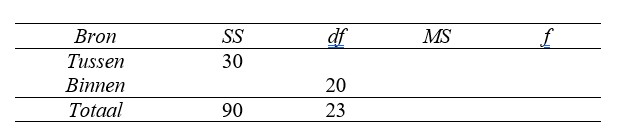

```{r, echo = FALSE, results = "hide"}
include_supplement("uu-Oneway-ANOVA-841-nl-graph01.jpg", recursive = TRUE)
```
Question
========
Uit een onderzoek is het resultaat gedeeltelijk in onderstaande ANOVA-tabel gepresenteerd.



Hieruit blijkt dat:

Answerlist
----------
* het gevonden resultaat significant is op 1% want $f_{obt}$ < $f_{crit}$
* het gevonden resultaat niet significant is op 1% want $f_{obt}$ < $f_{crit}$
* het gevonden resultaat niet significant is op 1% want $f_{obt}$ > $f_{crit}$
* het gevonden resultaat significant is op 1% want $f_{obt}$ > $f_{crit}$


Solution
========


Meta-information
================
exname: uu-Oneway ANOVA-841-nl
extype: schoice
exsolution: 0100
exsection: Inferential Statistics/Parametric Techniques/ANOVA/Oneway ANOVA
exextra[ID]: 7ca33
exextra[Type]: Interpretating output
exextra[Program]: 
exextra[Language]: Dutch
exextra[Level]: Statistical Reasoning