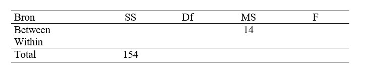

```{r, echo = FALSE, results = "hide"}
include_supplement("uu-Oneway-ANOVA-847-nl-graph01.jpg", recursive = TRUE)
```
Question
========
A study examined the effect of doing strength sports on antisocial behavior, among other things. Two groups were distinguished that differed in the number of months they had done strength sports prior to the study. In both groups, the sample size was 11. Below is part of the (fictitious) results in an ANOVA table. 



How big is F here?

Answerlist
----------
* 14.0
* 7.0
* 2.0
* 0.9


Solution
========

Meta-information
================
exname: uu-Oneway ANOVA-847-en
extype: schoice
exsolution: 0010
exsection: Inferential Statistics/Parametric Techniques/ANOVA/Oneway ANOVA
exextra[ID]: 15817
exextra[Type]: Interpretating output, Calculation
exextra[Program]: 
exextra[Language]: English
exextra[Level]: Statistical Literacy