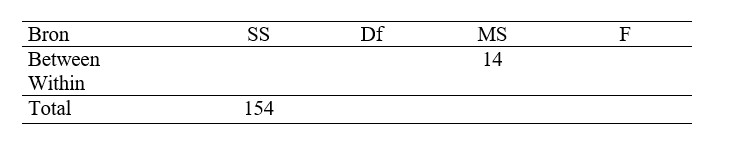

```{r, echo = FALSE, results = "hide"}
include_supplement("uu-Oneway-ANOVA-847-nl-graph01.jpg", recursive = TRUE)
```
Question
========
In een onderzoek is nagegaan wat het effect is van het doen van krachtsport op onder andere antisociaal gedrag. Er werden twee groepen onderscheiden die verschilden in het aantal maanden waarin ze krachtsport gedaan hadden voorafgaand aan het onderzoek. In beide groepen was de omvang van de steekproef 11. Hieronder vind je een deel van de (fictieve) resultaten in een ANOVA-tabel. 



Hoe groot is F hier?

Answerlist
----------
* 14.0
* 7.0
* 2.0
* 0.9


Solution
========


Meta-information
================
exname: uu-Oneway ANOVA-847-nl
extype: schoice
exsolution: 0010
exsection: Inferential Statistics/Parametric Techniques/ANOVA/Oneway ANOVA
exextra[Type]: Interpretating output, Calculation
exextra[Program]: 
exextra[Language]: Dutch
exextra[Level]: Statistical Literacy