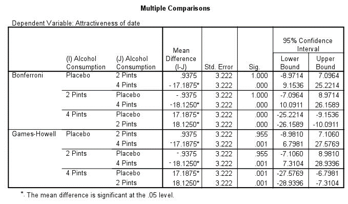

```{r, echo = FALSE, results = "hide"}
include_supplement("uu-Oneway-ANOVA-848-nl-tabel.png", recursive = TRUE)
```

Question
========
The research question of a study is whether drinking alcohol during a night out affects the assessment of potential partners' physical attractiveness. The hypothesis is that drinking alcohol interferes with a potential partner's perception of attractiveness. The study identified three groups, which differed in alcohol consumption (ALCOHOL CONSUMPTION): 1. placebo (were given no alcohol to drink), 2. two glasses (pints) of alcohol, 3. four glasses (pints) of alcohol.

Study participants had to rate the same person on physical attractiveness (ATTRACTIVENESS OF DATE, measured on a scale of 1 = very unattractive to 100 = very attractive).

An ANOVA on the data collected showed that the three groups were significantly different from each other in the mean rating of ATTRACTIVENESS OF DATE. Subsequently, a post hoc test was conducted. The SPSS output is shown below.




Based on this SPSS output, which conclusion is correct?

Answerlist
----------
* The three groups differ pairwise in their assessment of the potential partner's attractiveness.
* The group that drank two glasses of alcohol finds the potential partner most attractive.
* The group that drank four glasses of alcohol finds the potential partner more attractive than the groups that drank two or no glasses of alcohol.
* The group that drank no alcohol finds the potential partner less attractive than the group that drank two glasses of alcohol.


Solution
========

Meta-information
================
exname: uu-Oneway ANOVA-848-en
extype: schoice
exsolution: 0010
exsection: Inferential Statistics/Parametric Techniques/ANOVA/Oneway ANOVA
exextra[Type]: Interpretating output
exextra[Program]: SPSS
exextra[Language]: English
exextra[Level]: Statistical Literacy