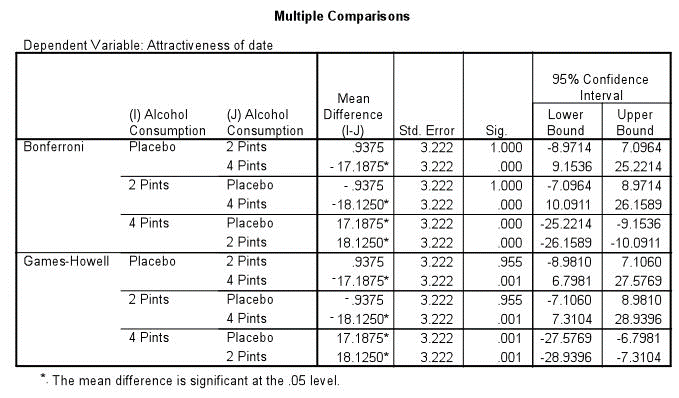

```{r, echo = FALSE, results = "hide"}
include_supplement("uu-Oneway-ANOVA-848-nl-tabel.png", recursive = TRUE)
```


Question
========
De onderzoeksvraag van een studie is of het drinken van alcohol tijdens een avond stappen invloed heeft op de beoordeling van de fysieke aantrekkelijkheid van potentiële partners. De hypothese is dat het drinken van alcohol de perceptie van aantrekkelijkheid van een potentiële partner verstoort. In het onderzoek werden drie groepen, die verschillen in alcoholconsumptie (ALCOHOL CONSUMPTION), onderscheiden:
1. placebo (kregen geen alcohol te drinken), 
2. twee glazen (pints) alcohol,
3. vier glazen (pints) alcohol.

De deelnemers aan het onderzoek moesten dezelfde persoon beoordelen op fysieke aantrekkelijkheid (ATTRACTIVENESS OF DATE, gemeten op een schaal van 1 = zeer onaantrekkelijk tot 100 = zeer aantrekkelijk). 

In een ANOVA op de verzamelde gegevens bleek dat de drie groepen significant van elkaar verschilden in de gemiddelde beoordeling van ATTRACTIVENESS OF DATE. Aansluitend is een post-hoc toetsing uitgevoerd. De SPSS-uitvoer staat hieronder.




Welke conclusie is correct als je je baseert op deze SPSS-uitvoer?

Answerlist
----------
* De drie groepen verschillen onderling paarsgewijs in de beoordeling van de aantrekkelijkheid van de potentiële partner.
* De groep die twee glazen alcohol dronk, vindt de potentiële partner het aantrekkelijkst.
* De groep die vier glazen alcohol dronk, vindt de potentiële partner aantrekkelijker dan de groepen die twee of geen glazen alcohol dronken.
* De groep die geen alcohol dronk, vindt de potentiële partner minder aantrekkelijk dan de groep die twee glazen alcohol dronk.


Solution
========


Meta-information
================
exname: uu-Oneway ANOVA-848-nl
extype: schoice
exsolution: 0010
exsection: Inferential Statistics/Parametric Techniques/ANOVA/Oneway ANOVA
exextra[ID]: ff555
exextra[Type]: Interpretating output
exextra[Program]: SPSS
exextra[Language]: Dutch
exextra[Level]: Statistical Literacy