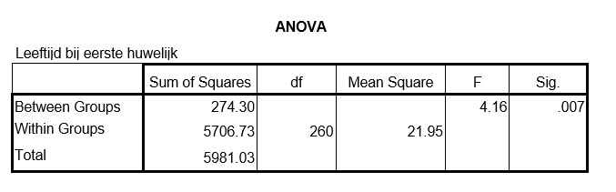

```{r, echo = FALSE, results = "hide"}
include_supplement("uu-Oneway-ANOVA-849-nl-graph01.jpg", recursive = TRUE)
```
Question
========
In een onderzoek naar trouw-leeftijd worden getrouwde mannen gevraagd hoe oud ze waren toen ze (voor het eerst) in het huwelijksbootje stapten. De wetenschapper wil onderzoeken of er verschillen zijn in gemiddelde leeftijd bij het eerste huwelijk tussen mannen met verschillende godsdienstige overtuigingen: katholiek, protestant, islam, of geen. De SPSS-output van de analyse staat hieronder.



Hoeveel mannen hebben meegedaan aan dit onderzoek?

Answerlist
----------
* 260
* 261
* 263
* 264


Solution
========


Meta-information
================
exname: uu-Oneway ANOVA-849-nl
extype: schoice
exsolution: 0001
exsection: Inferential Statistics/Parametric Techniques/ANOVA/Oneway ANOVA
exextra[Type]: Interpretating output
exextra[Program]: 
exextra[Language]: Dutch
exextra[Level]: Statistical Reasoning