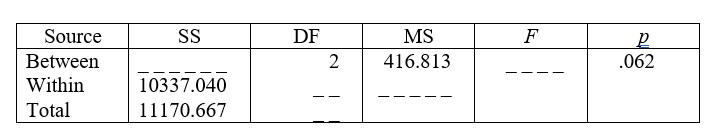

```{r, echo = FALSE, results = "hide"}
include_supplement("uu-Oneway-ANOVA-857-nl-graph01.jpg", recursive = TRUE)
```
Question
========
In a study in education, 75 students are randomly assigned to three classes. The first class receives Mathematics A instruction with an emphasis on group work, the second class receives standard lessons, and the third class emphasizes individual tutoring and practice. At the end of the period, students' math A skills are tested with a test paper. Is there an effect of teaching method on students' grades? Part of the ANOVA table is below. 



What is the value of the effect size to be reported in this analysis?

Answerlist
----------
* There are no significant differences between the teaching methods, F(2, 72) = 2.90, p=.062.
* There are significant differences between teaching methods, F(2, 72) = 2.90, p=.031.
* There are significant differences between teaching methods, F(2, 75) = 3.02, p =.031.
* There are no significant differences between the teaching methods, F(2, 75) = 3.02, p=.062.


Solution
========

Meta-information
================
exname: uu-Oneway ANOVA-857-en
extype: schoice
exsolution: 1000
exsection: Inferential Statistics/Parametric Techniques/ANOVA/Oneway ANOVA
exextra[Type]: Interpretating output, Calculation
exextra[Program]: 
exextra[Language]: English
exextra[Level]: Statistical Literacy