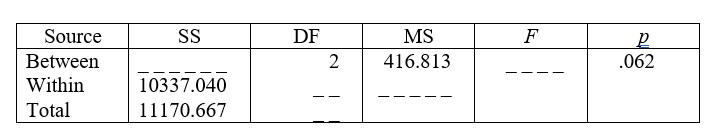

```{r, echo = FALSE, results = "hide"}
include_supplement("uu-Oneway-ANOVA-857-nl-graph01.jpg", recursive = TRUE)
```
Question
========
In een onderzoek in het onderwijs worden 75 leerlingen at random aan drie klassen toegewezen. De eerste klas krijgt wiskunde A-onderwijs met de nadruk op groepswerk, de tweede klas krijgt standaardlessen en in de derde klas ligt de nadruk op individuele begeleiding en oefening. Aan het einde van de periode wordt de wiskunde A-vaardigheid van de leerlingen getoetst met een proefwerk. Is er een effect van onderwijsmethode op de cijfers van de leerlingen? Een deel van de ANOVA-tabel staat hieronder. 



Wat is de waarde van de effectgrootte die bij deze analyse gerapporteerd moet worden?

Answerlist
----------
* Er zijn geen significante verschillen tussen de onderwijsmethoden, F(2, 72) = 2.90, p=.062.
* Er zijn significante verschillen tussen de onderwijsmethoden, F(2, 72) = 2.90, p =.031.
* Er zijn significante verschillen tussen de onderwijsmethoden, F(2, 75) = 3.02, p =.031.
* Er zijn geen significante verschillen tussen de onderwijsmethoden, F(2, 75) = 3.02, p=.062.


Solution
========


Meta-information
================
exname: uu-Oneway ANOVA-857-nl
extype: schoice
exsolution: 1000
exsection: Inferential Statistics/Parametric Techniques/ANOVA/Oneway ANOVA
exextra[Type]: Interpretating output, Calculation
exextra[Program]: 
exextra[Language]: Dutch
exextra[Level]: Statistical Literacy