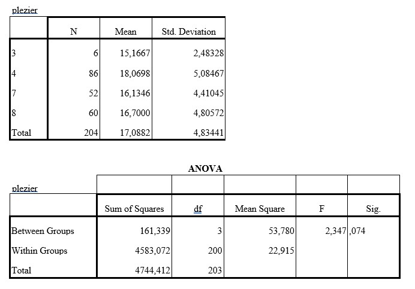

```{r, echo = FALSE, results = "hide"}
include_supplement("uu-Oneway-ANOVA-858-nl-graph01.jpg", recursive = TRUE)
```
Question
========
In a study on school enjoyment, a sample of students in grades 3, 4, 7 and 8 from a number of elementary schools were given a questionnaire with eight questions measuring school enjoyment. For all questions, there were four response categories where a high score meant that the student enjoyed going to school.

Analysis of variance was used to determine whether the groups differed in terms of school enjoyment. Tested with $\alpha$ = .05. The SPSS output can be found below.




What is the conclusion based on this output?

Answerlist
----------
* The groups do not differ significantly in school enjoyment.
* The groups do not differ significantly in school enjoyment, but a post hoc analysis should be conducted to see which groups might differ significantly.
* The groups differ significantly in school enjoyment, children from group 4 have more enjoyment than the other groups.
* The groups differ significantly in school enjoyment, a post hoc analysis should be conducted to find out which groups differ significantly in school enjoyment.


Solution
========

Meta-information
================
exname: uu-Oneway ANOVA-858-en
extype: schoice
exsolution: 1000
exsection: Inferential Statistics/Parametric Techniques/ANOVA/Oneway ANOVA
exextra[ID]: b92c5
exextra[Type]: Interpretating output
exextra[Program]: 
exextra[Language]: English
exextra[Level]: Statistical Literacy